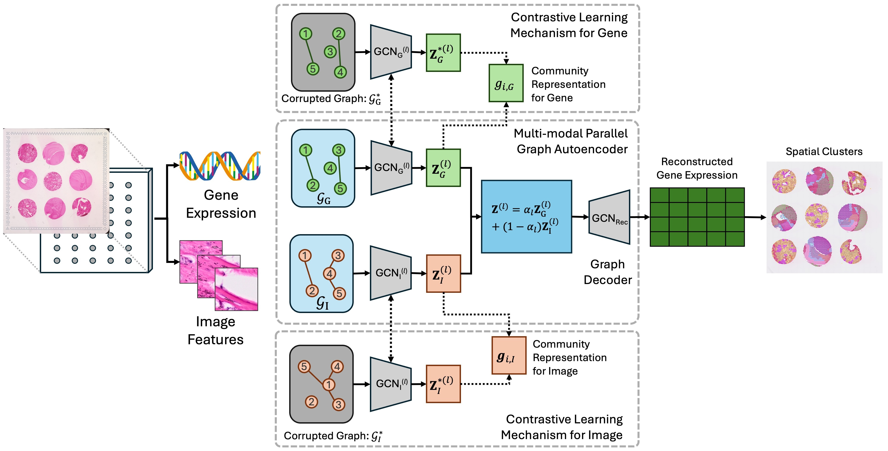

# Spatial Transcriptomics Multi-modal Clustering (stMMC)
This is the repo of the code for the paper, "Multi-modal Spatial Clustering for Spatial Transcriptomics Utilizing High-resolution Histology Images"



## Envrioment Setting
An enviroment yaml file is provide and the needed enviroment can be created using the following command, which requires [conda](https://conda.io/projects/conda/en/latest/user-guide/install/index.html).

```bash
conda env create -f environment.yml
```

R and *mclust* package are also needed to run stMMC. Instructions to install R can be found [here](https://www.r-project.org) and to install *mclust* package run the following command in R.

```r
install.packages('mclust')
```

## Demo on DLPFC Slice 151507
This repo also includes the demo data from [DLPFC](http://research.libd.org/spatialLIBD/) dataset. To run stMMC on this demo data with all the default settings, you can run the following command to get the clustering results.

```bash
conda activate stMMC
python src/main.py
```
